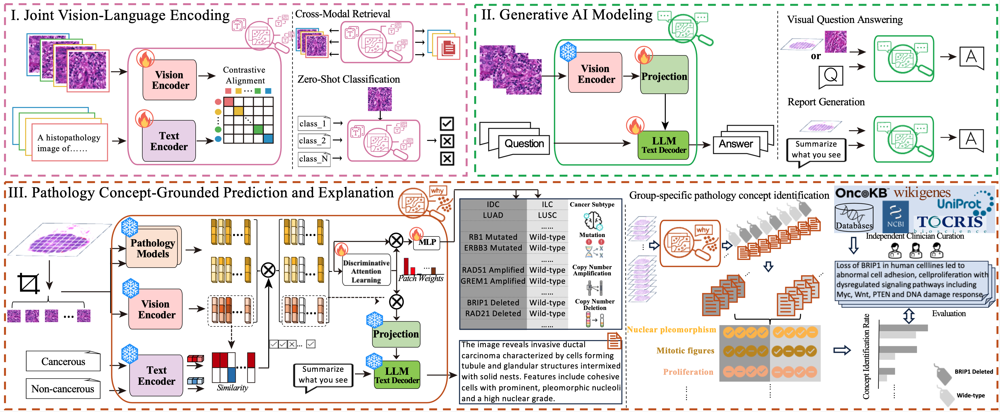

# ENLIGHT: Interpretable Multimodal AI for Grounded Cancer Pathology Diagnosis and Molecular Profiling



Artificial intelligence (AI)-powered computational pathology has emerged as an increasingly useful tool in cancer evaluation, augmenting clinical interpretation and uncovering previously unrecognized relationships between tissue morphology and underlying molecular alterations. Recent advances in pathology foundation models have enabled diagnostic workflows with unprecedented scalability and efficiency. However, standard AI models remain black boxes, offering limited interpretability and insufficient pathological grounding to justify their assessments. Here we establish **E**xplainable **N**eoplasm **L**earning **i**n **G**rounded **H**istology **T**erms (ENLIGHT), a large multimodal model (LMM) designed to systematically identify cancer diagnosis, subtypes, and genetic alterations across 28 organs. We trained ENLIGHT on 38.36 million pathology image-text pairs and evaluated it on 5.68 million independent validation samples across 40 patient cohorts from 44 institutions worldwide, covering six categories of core diagnostic tasks. ENLIGHT demonstrates strong generalizability in zero-shot classification, cancer subtyping, cross-modal retrieval, visual question answering, report generation, and molecular profile prediction. Across these tasks, it consistently outperforms state-of-the-art (SOTA) pathology models tailored to predictive objectives by up to 12\%, and generative tasks by up to 281\% (mean ROUGE-L for six open-ended visual question answer benchmarks) on independent, unseen cohorts. Importantly, ENLIGHT explains its diagnostic decisions using interpretable pathological concepts that align with established medical knowledge, while uncovering novel links between tissue morphology and molecular alterations. By integrating the reasoning capabilities of LMMs with interpretable pathology grounding, ENLIGHT provides a versatile, scalable, and transparent platform to advance biomedical research, education, and clinical decision support in pathology.

## Install environment

See [environment.md](environment.md) for setup instructions.

## Download checkpoints

Download from
Set the path to $CKPTDIR

## Download data example

Download from
Set the path to $DATADIR


## Zero-shot classification

See [eval-zeroshot/dataset.md](eval-zeroshot/dataset.md) for the full list of datasets and download links.

##### Evaluate cancer grading

Set path to $BASE
```
python eval-zeroshot/zeroshot_classification.py --database $BASE --data AGGC22 --pretrained_path $CKPTDIR/enlight-fm/enlight-visual-encoder.pt --task grading
```

##### Evaluate microenvironment classification

Set path to $BASE

```
python eval/zeroshot_classification.py --database $BASE --data SPIDER_colon --pretrained_path $CKPTDIR/enlight-fm/enlight-visual-encoder.pt 
```

## Zero-shot retrieval

##### Download datasets

TCGA-UT: https://zenodo.org/records/5889558##.YuJHdd_RaUk

Set path to $BASE

##### Evaulate image2text, text2image retrieval

```
python eval/zeroshot_retrieval.py --database $BASE --data ut-0 --pretrained_path $CKPTDIR/enlight-fm/enlight-visual-encoder.pt
```

## Visual question answering

### Patch-image QA benchmarks

##### Download dataset

PathMMU: https://huggingface.co/datasets/jamessyx/PathMMU

PathVQA: https://huggingface.co/datasets/dz-osamu/PathVQA

Set path to $IMG_DIR

##### Preprocess to format

```
python eval-vqa/format_vqa_batch_infer.py $IMG_DIR pathmmu
```

##### Infer to answer

```
BASE=$IMG_DIR CKPTDIR=$CKPTDIR bash eval/vqa_batch_infer-pathmmu.sh
```

### Slide QA Example

```
CKPTDIR=$CKPTDIR DATADIR=$DATADIR bash eval-vqa/vqa_infer_slide.sh
```

## Explainable Classification

### Classify and Explain Subtyping

```
CKPTDIR=$CKPTDIR DATADIR=$DATADIR bash eval-xclassify/explain_classify.sh
```

### Classify and Explain Molecular Alteration

```
CKPTDIR=$CKPTDIR DATADIR=$DATADIR bash eval-xclassify/explain_classify.sh
```

## Acknowledgements

We thank the open-source repositories as below:

[open_clip](https://github.com/mlfoundations/open_clip)

[LLaVA](https://github.com/haotian-liu/LLaVA)

[Quilt-1M](https://github.com/wisdomikezogwo/quilt1m)

[PathAssist](https://github.com/superjamessyx/Generative-Foundation-AI-Assistant-for-Pathology)

## Issues

Please open new threads or address all questions to [xuan_gong@hms.harvard.edu](mailto:xuan_gong@hms.harvard.edu) or [Kun-Hsing_Yu@hms.harvard.edu](mailto:Kun-Hsing_Yu@hms.harvard.edu)
